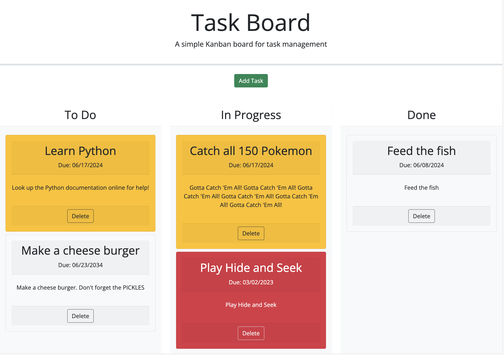

# Task Board

## Description

Bootcamp Challenge 05 Third Party APIs: Code Refactor - For this project student is tasked to create a simple task board application that allows a team to manage project tasks. Students are given starter code to begin with that is extremely helpful in organizing a plan of approach in the overall structure of this project as well as a bootstrap page layout. The majority of the work entailed building the JavaScript logic and functionality for the various tasks this task board needed to perform.

Some of the key concepts that came into play were bootstrap and jQuery's various UI enhancements like cards and sortable lists.

## User Story

```md
AS A project team member with multiple tasks to organize
I WANT a task board 
SO THAT I can add individual project tasks, manage their state of progress and track overall project progress accordingly
```

## Acceptance Criteria

```md
GIVEN a task board to manage a project
WHEN I open the task board
THEN the list of project tasks is displayed in columns representing the task progress state (Not Yet Started, In Progress, Completed)
WHEN I view the task board for the project
THEN each task is color coded to indicate whether it is nearing the deadline (yellow) or is overdue (red)
WHEN I click on the button to define a new task
THEN I can enter the title, description and deadline date for the new task into a modal dialog
WHEN I click the save button for that task
THEN the properties for that task are saved in localStorage
WHEN I drag a task to a different progress column
THEN the task's progress state is updated accordingly and will stay in the new column after refreshing
WHEN I click the delete button for a task
THEN the task is removed from the task board and will not be added back after refreshing
WHEN I refresh the page
THEN the saved tasks persist
```

## Usage

To view the webpage please visit the following link.
[Link](https://daniels-pancakes.github.io/Task-Board/)

There are additional comments within the JavaScript code. There are comments throughout the GitHub repository commits.
[Link](https://github.com/daniels-pancakes/Task-Board/)

## Preview



## Credits

- mdn web docs
- W3Schools
- The Coding Boot Camp at UT Austin